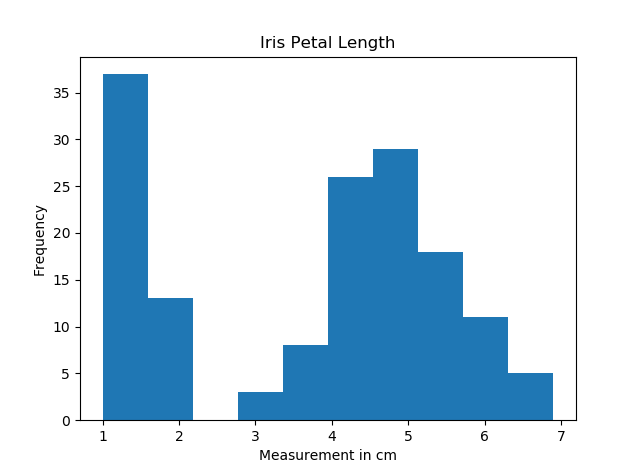
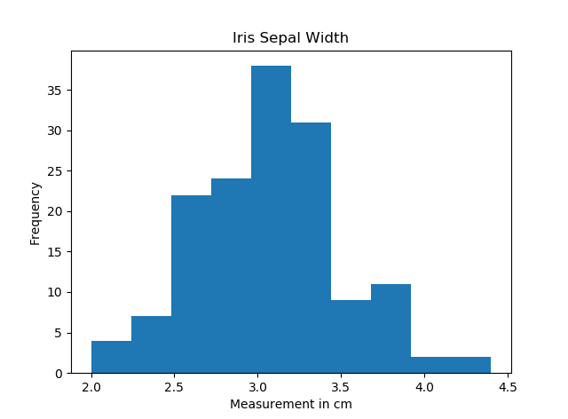

# Programming-Project_2018
## An analysis of the Iris Data Set for the project submission for Programming & Scripting Course 2018

 
## Preface
This repository is submitted by Justin Rutherford for grading to Dr. Ian McLoughlin as the project part of the module on Programming and Scripting from the course in Higher Diploma in Data Analytics at GMIT.  The module commenced in January 2018 and this submission dated 28.4.18 completes it.
The project requirements are as follows;
1.	Research and investigate the Fisher’s Iris data set .
2.	Use Python code to perform the investigation and analysis.
3.	Summarise the analysis with a report presented in a Readme.md file in the repository.
4.	Include supporting tables and graphics as required.
5.	Reference material accordingly, and uphold the GMIT Quality Assurance Framework .

## The Iris Data Set
### Introduction and Background
Fisher’s Iris Data Set is arguably the most widely know database primarily used as learning material in the field of pattern recognition, machine learning and data analytics.
The data set was formulated by a British statistician and biologist, [Ronald Fisher](https://en.wikipedia.org/wiki/Ronald_Fisher and published in his paper The use of multiple measurements in taxonomic problems, in 1936.  The actual data was collected by Edgar Anderson, along the shore of the Saint Lawrence River in Quebec, Canada.
The data set consists of 150 samples of three species of Iris flower (Setosa, Versicolor, Virginica).  Each species has 50 samples.  Each flower was measured for four features namely, sepal length, sepal width, petal length, and petal width.  The measurement is in centimetres (cm’s).  Based on the features, Fisher developed a linear discriminant analysis model to distinguish the species from each other. 

### The Investigative Process
1.	The data set was downloaded from the following address; https://archive.ics.uci.edu/ml/machine-learning-databases/iris/iris.data
2.	The data set as saved as a CSV file in a local folder which as then uploaded and synchronised  to the current repository (https://github.com/jruther/Programming-Project_2018).
3.	A new folder was opened in Visual Studio Code to run the analysis using python code.
4.	A link was established to the repository to upload saved commits as the analysis progressed.
5.	The NumPy package was imported to perform the fundamental analysis.
6.	The Seaborn package was imported to provide a visualisation of the data.
7.	The Pandas package was imported to run machine learning code and perform data analysis and visualisation of results.

### Repository Reference Guide
In order to run different python scripts and use the different packages a simple naming scheme was adopted.  Scripts are named as follows;
1.	Iris.py (for the purpose of viewing the file content as string and providing a column name, not contained in the raw data file).
2.	Iris1.py (for fundamental analysis using NumPy, and generation of a results table)
3.	Iris2.py (for graphical analysis and results using Seaborn)
4.	Iris3.py (for machine learning using Pandas)

### Analytical Results & Summary
#### The Iris1.py file contains the code generating the following results.

The size of the file is: 750

The number of rows and columns in the files is: (150, 5)

The first column contains the sepal length in cm's.
The second column contains the sepal width in cm's.
The third column contains the petal length in cm's.
The fourth column contains the petal width in cm's.
The fifth column contains the species type in cm's.

Rows 1 to 50 refer to Iris Setosa samples
Rows 51 to 100 refer to Iris Versicolor samples.
Rows 101 to 150 refer to Irish Virginica samples.

The minimum sepal length in cm is: 4.3
The maximum sepal length in cm is: 7.9
The mean sepal length in cm is: 5.84333333333
The median sepal length in cm is: 5.8

The minimum sepal width in cm is: 2.0
The maximum sepal width in cm is: 4.4
The mean sepal width in cm is: 3.054
The median sepal width in cm is: 3.0

The minimum petal length in cm is: 1.0
The maximum petal length in cm is: 6.9
The mean petal length in cm is: 3.75866666667
The median petal length in cm is: 4.35

The minimum petal width in cm is: 0.1
The maximum petal width in cm is: 2.5
The mean petal width in cm is: 1.19866666667
The median petal width in cm is: 1.3

The minimum setosa sepal lenght in cm is: 4.3
The maximum setosa sepal lenght in cm is: 5.8
The mean setosa sepal lenght in cm is: 5.006
The median setosa sepal lenght in cm is: 5.0

The minimum versicolor sepal length in cm is: 4.9
The maximum versicolor sepal length in cm is: 6.9
The mean versicolor sepal length in cm is: 5.91428571429
The median versicolor sepal lenght in cm is: 5.9

The minimum virginica sepal length in cm is: 4.9
The maximum virginica sepal length in cm is: 7.9
The mean virginica sepal length in cm is: 6.59387755102
The median virginica sepal length in cm is: 6.5

The minimum setosa sepal width in cm is: 2.3
The maximum setosa sepal width in cm is: 4.4
The mean setosa sepal width in cm is: 3.418
The median setosa sepal width in cm is: 3.4

The minimum versicolor sepal width in cm is: 2.0
The maximum versicolor sepal width in cm is: 3.4
The mean versicolor sepal width in cm is: 2.7612244898
The median versicolor sepal width in cm is: 2.8

The minimum virginica sepal width in cm is: 2.2
The maximum virginica sepal width in cm is: 3.8
The mean virginica sepal width in cm is: 2.96734693878
The median virginica sepal width in cm is: 3.0

The minimum setosa petal length in cm is: 1.0
The maximum setosa petal length in cm is: 1.9
The mean setosa petal length in cm is: 1.464
The median setosa petal length in cm is: 1.5

The minimum versicolor petal length in cm is: 3.0
The maximum versicolor petal length in cm is: 5.1
The mean versicolor petal length in cm is: 4.25102040816
The median versicolor petal length in cm is: 4.3

The minimum virginica petal length in cm is: 4.5
The maximum virginica petal length in cm is: 6.9
The mean virginica petal length in cm is: 5.54285714286
The median virginica petal length in cm is: 5.5

The minimum setosa petal width in cm is: 0.1
The maximum setosa petal width in cm is: 0.6
The mean setosa petal width in cm is: 0.244
The median setosa petal width in cm is: 0.2

The minimum versicolor petal width in cm is: 1.0
The maximum versicolor petal width in cm is: 1.8
The mean versicolor petal width in cm is: 1.32448979592
The median versicolor petal width in cm is: 1.3

The minimum virginica petal width in cm is: 1.4
The maximum virginica petal width in cm is: 2.5
The mean virginica petal width in cm is: 2.01632653061
The median virginica petal width in cm is: 2.0

I maybe guilty of 'overanalysis' in this report....!

#### The Iris2.py file contains the code generating the following results.

A comparison of the sepal length vs the sepal width was run for the three species of Iris flower.

The setosa plant has the lowest ratio, therefore it's sepal length and width are most uniform.
The virginica plant has the highest ratio, therefore it's sepal length and width are most diverse.

https://github.com/jruther/Programming-Project_2018/blob/master/Iris%20Sepal%20Width.png

